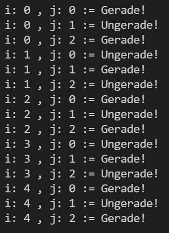

# Exercise

Hello folks!

Welcome to the next programming exercise in this course.

## Tasks of the programming exercise

The task is to program the function

```cpp
void mod_cross_sum(int I, int J);
```

which prints the following output to the console:

In the function, the task is to iterate over a given run-size I and run-size J. The task is to output the following output.  
At each iteration, it is to be output whether the sum of the current i (for i in I) and j (for j in J) is even or odd.  
That is, whether the result of (i + j) returns an even or odd number.

The function should be declared in the exercise.h file and defined in the exercise.cc (or exercise.cpp) file.

## Example


